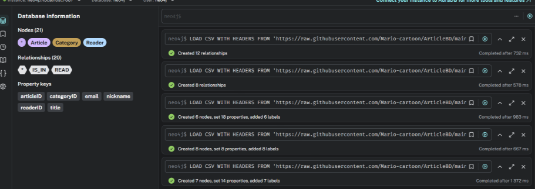
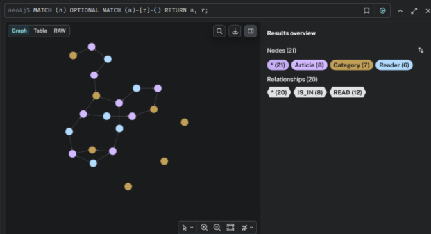
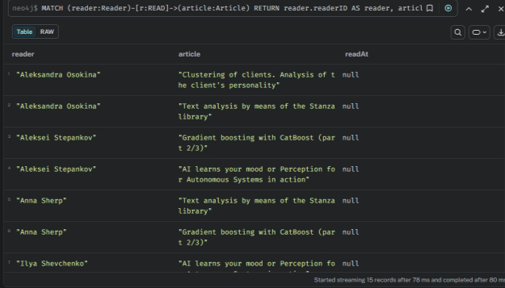
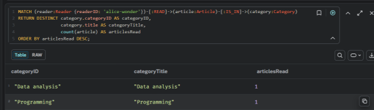
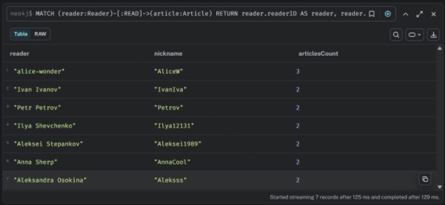
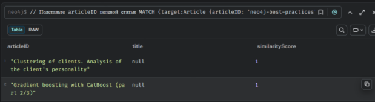
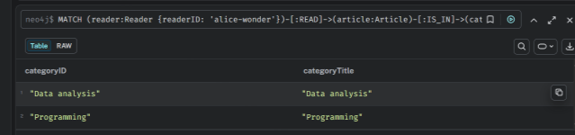
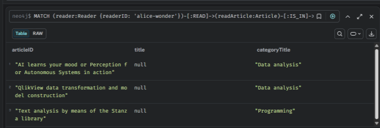

## Решение заданий:

## Подготовка

Запустить Neo4j контейнер
```
docker compose up -d
```

Импортировать датасет из README.md
```cypher
LOAD CSV WITH HEADERS FROM
'https://raw.githubusercontent.com/Mario-cartoon/ArticleBD/main/Category.csv'
AS line FIELDTERMINATOR ','
MERGE (category:Category {categoryID: line.title})
  ON CREATE SET category.title = line.title;

LOAD CSV WITH HEADERS FROM
'https://raw.githubusercontent.com/Mario-cartoon/ArticleBD/main/Articles.csv'
AS line FIELDTERMINATOR ','
MERGE (article:Article {articleID: line.title});

LOAD CSV WITH HEADERS FROM
'https://raw.githubusercontent.com/Mario-cartoon/ArticleBD/main/Reader.csv'
AS line FIELDTERMINATOR ','
MERGE (reader:Reader {readerID: line.name})
  ON CREATE SET reader.nickname = line.nickname,reader.email = line.email;

LOAD CSV WITH HEADERS FROM 'https://raw.githubusercontent.com/Mario-cartoon/ArticleBD/main/Category_articles.csv' AS line
MATCH (category:Category {categoryID: line.title_category})
MATCH (article:Article {articleID: line.title_article})
CREATE (article)-[:IS_IN]->(category);

LOAD CSV WITH HEADERS FROM 'https://raw.githubusercontent.com/Mario-cartoon/ArticleBD/main/read_articles.csv' AS line
MATCH (reader:Reader {readerID: line.name})
MATCH (article:Article {articleID: line.title_article})
CREATE (reader)-[:READ]->(article);
```






---
## Вставка

### Добавить категорию 

```cypher
MERGE (category:Category {categoryID: 'tech-news'})
ON CREATE SET category.title = 'Технологии и новости';
```


### Добавить статью

```cypher
MERGE (article:Article {articleID: 'neo4j-best-practices'})
  ON CREATE SET article.title = 'Лучшие практики работы с Neo4j',
                article.publishedAt = datetime();

// Связать статью с категорией
MATCH (article:Article {articleID: 'neo4j-best-practices'})
MATCH (category:Category {categoryID: 'tech-news'})
MERGE (article)-[:IS_IN]->(category);
```


### Добавить читателя, добавить связь с 3 статьями

```cypher
// Создаём читателя
MERGE (reader:Reader {readerID: 'alice-wonder'})
  ON CREATE SET reader.nickname = 'AliceW',
                reader.email = 'alice@example.com';

// Связываем с существующими статьями (3-5 штук)
MATCH (reader:Reader {readerID: 'alice-wonder'})
MATCH (article:Article) 
WHERE article.articleID IN [
  'neo4j-best-practices', 
  'Gradient boosting with CatBoost (part 2/3)', 
  'Clustering of clients. Analysis of the client\'s personality'
]
FOREACH (a IN [article] | 
  MERGE (reader)-[:READ {readAt: datetime()}]->(a)
);
```


---
## Запросы

### Отобразить всех пользователей, статьи и связи между ними

```cypher
MATCH (reader:Reader)-[r:READ]->(article:Article)
RETURN reader.readerID AS reader, 
       article.articleID AS article,
       r.readAt AS readAt
ORDER BY reader.readerID;
```



### Выбрать пользователя и найти категории, которые он читает

```cypher
MATCH (reader:Reader {readerID: 'alice-wonder'})-[:READ]->(article:Article)-[:IS_IN]->(category:Category)
RETURN DISTINCT category.categoryID AS categoryID,
                category.title AS categoryTitle,
                count(article) AS articlesRead
ORDER BY articlesRead DESC;
```



### Найти самых активных читателей (посчитать, кто читает больше всего статей)

```cypher
MATCH (reader:Reader)-[:READ]->(article:Article)
RETURN reader.readerID AS reader,
       reader.nickname AS nickname,
       count(article) AS articlesCount
ORDER BY articlesCount DESC
LIMIT 10;
```



### Выбрать статью и найти похожие статьи (статьи, которые читают те же пользователи)

```cypher
// Подставьте articleID целевой статьи
MATCH (target:Article {articleID: 'neo4j-best-practices'})<-[:READ]-(reader:Reader)-[:READ]->(similar:Article)
WHERE target <> similar
WITH similar, count(DISTINCT reader) AS commonReaders
ORDER BY commonReaders DESC
LIMIT 10
RETURN similar.articleID AS articleID,
       similar.title AS title,
       commonReaders AS similarityScore;
```



### Рекомендации по категориям


#### Найти категории, которые читает пользователь

```cypher
MATCH (reader:Reader {readerID: 'alice-wonder'})-[:READ]->(article:Article)-[:IS_IN]->(category:Category)
RETURN DISTINCT category.categoryID AS categoryID,
                category.title AS categoryTitle;
```



#### Предложить статьи из этих категорий, которые он ещё не читал 


```cypher
MATCH (reader:Reader {readerID: 'alice-wonder'})-[:READ]->(readArticle:Article)-[:IS_IN]->(category:Category)
WITH reader, collect(DISTINCT readArticle) AS readArticles, collect(DISTINCT category) AS readCategories

UNWIND readCategories AS category
MATCH (category)<-[:IS_IN]-(recommended:Article)
WHERE NOT recommended IN readArticles
AND NOT (reader)-[:READ]->(recommended)
RETURN recommended.articleID AS articleID,
recommended.title AS title,
category.title AS categoryTitle
ORDER BY categoryTitle
LIMIT 10;
```


