## дз по индексам

### написание 5 запросов в бд

```sql
EXPLAIN (ANALYZE, BUFFERS)
SELECT * FROM analytics.passenger_profile
WHERE passport_id = 4900;
```

```sql
EXPLAIN (ANALYZE, BUFFERS)
SELECT * FROM analytics.luggage_inspection
WHERE notes like 'Inspection note 2%';
```

```sql
EXPLAIN (ANALYZE, BUFFERS)
SELECT * FROM analytics.luggage_inspection
WHERE item_count >= 16;
```

```sql
EXPLAIN (ANALYZE, BUFFERS)
SELECT * from analytics.criminal_screening
WHERE screening_score BETWEEN 6 AND 9;
```

```sql
EXPLAIN (ANALYZE, BUFFERS)
SELECT * FROM analytics.border_crossing
WHERE transport_type IN ('TRAIN', 'BUS');
```

---
### Анализ работы запросов без индексов: 

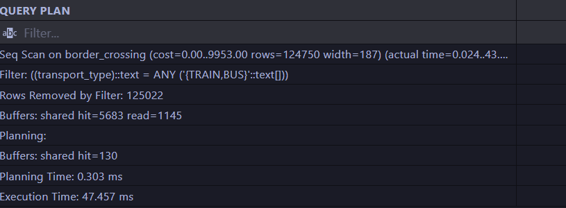
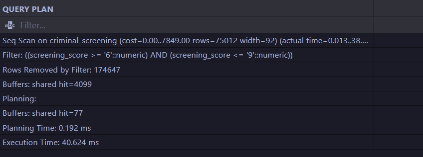
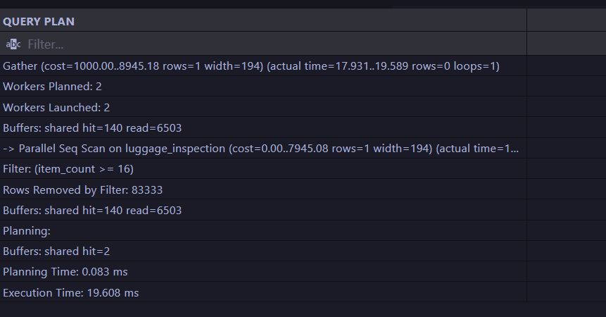
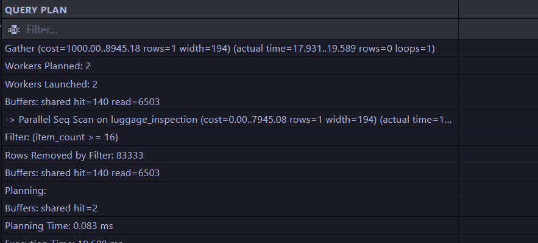
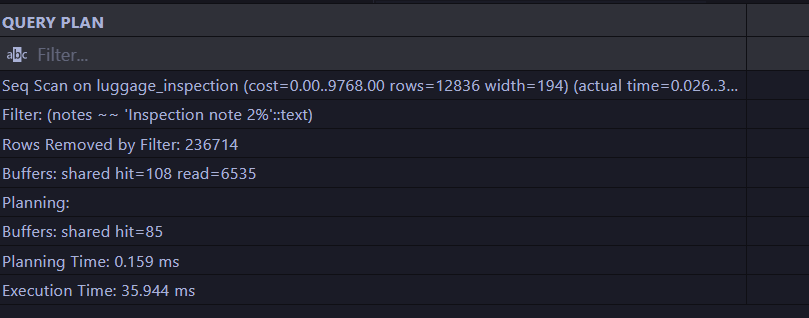

в них всех просходит seq scan и реальное время запроса занимает примерно в 100 раз больше ожидаемого


### Анализ работы запросов с помощью B-tree индексов

```sql
CREATE INDEX IF NOT EXISTS passenger_passport_id 
ON analytics.passenger_profile (passport_id);

CREATE INDEX IF NOT EXISTS notes_in_luggage_inspection 
ON analytics.luggage_inspection (notes);

CREATE INDEX IF NOT EXISTS item_count_in_luggage_inspection
ON analytics.luggage_inspection (item_count);

CREATE INDEX IF NOT EXISTS screening_score_in_criminal_screening
ON analytics.criminal_screening (screening_score);

CREATE INDEX IF NOT EXISTS transport_type_in_border_crossing
ON analytics.border_crossing (transport_type);
```

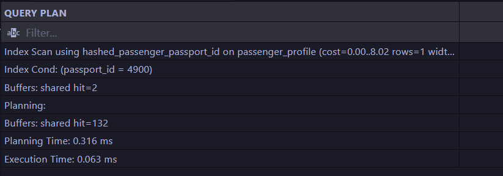
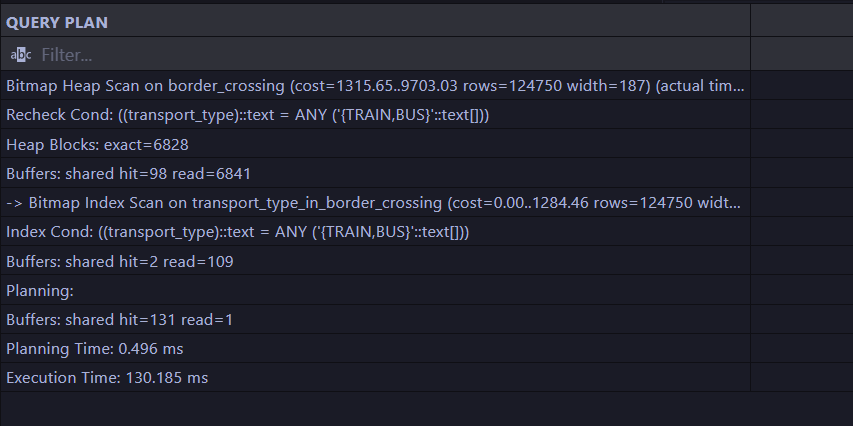
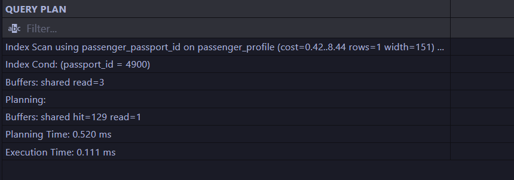
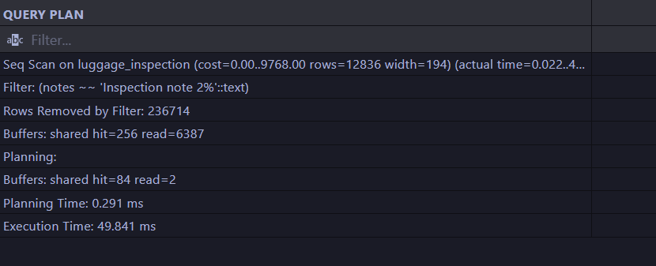
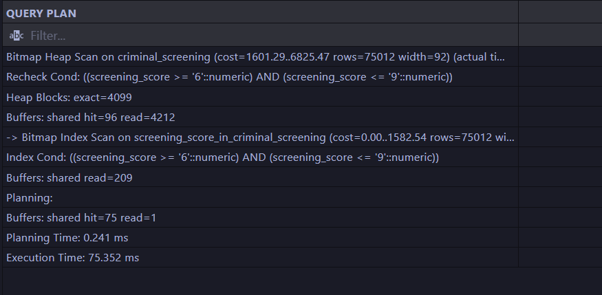

благодаря индексам ускорлись 1 и 3.
Запрос 2 не ускорился из-за полнотекстового поиска
Запрос 4 не ускорился из-за приведения данных
Запрос 5 не ускорился из-за низкой каардинальности


### Анализ работы запросов с помощью B-tree индексов

```sql
CREATE INDEX IF NOT EXISTS hashed_passenger_passport_id 
ON analytics.passenger_profile USING hash(passport_id);

CREATE INDEX IF NOT EXISTS hashed_notes_in_luggage_inspection 
ON analytics.luggage_inspection USING hash(notes);

CREATE INDEX IF NOT EXISTS hashed_item_count_in_luggage_inspection
ON analytics.luggage_inspection USING hash(item_count);

CREATE INDEX IF NOT EXISTS hashed_screening_score_in_criminal_screening
ON analytics.criminal_screening USING hash(screening_score);

CREATE INDEX IF NOT EXISTS hashed_transport_type_in_border_crossing
ON analytics.border_crossing USING hash(transport_type);
```

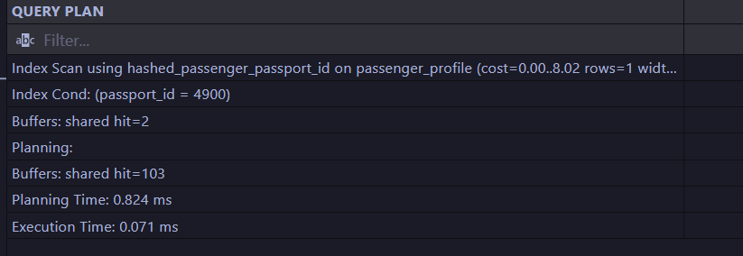
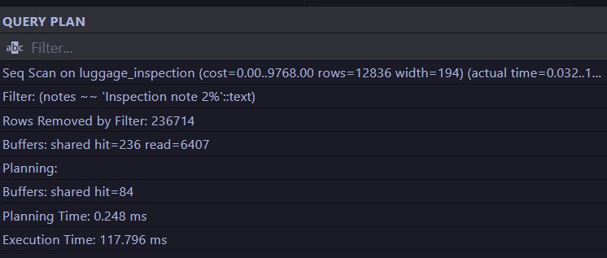
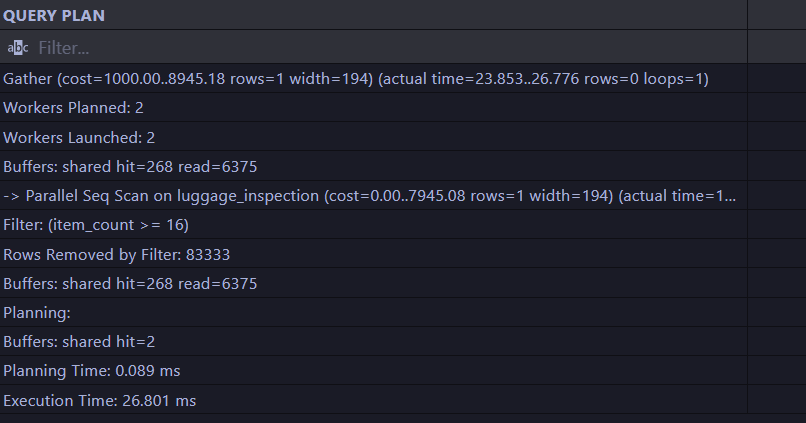
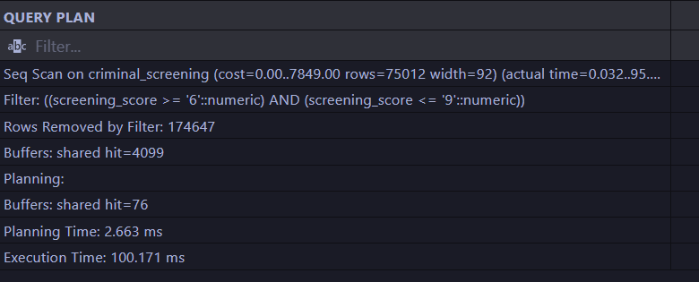
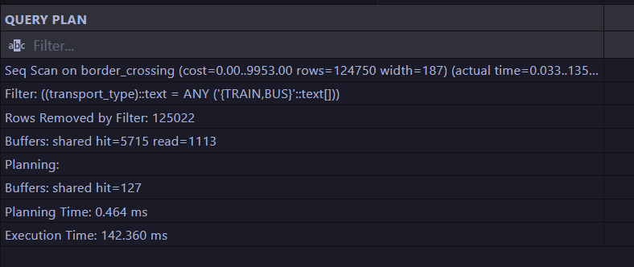


благодаря индексу ускорился запрос 1

Запрос 3 (в отличие от B-tree индекса) не ускорился из-за того, что там испоьзуется не точное сравнение