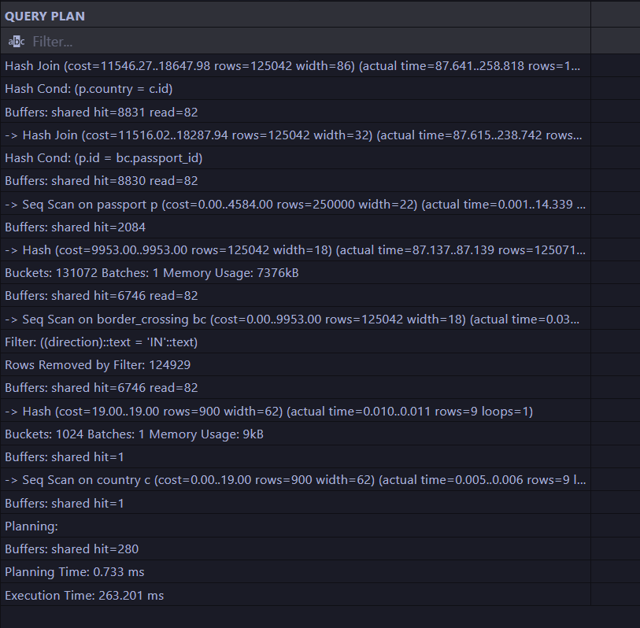
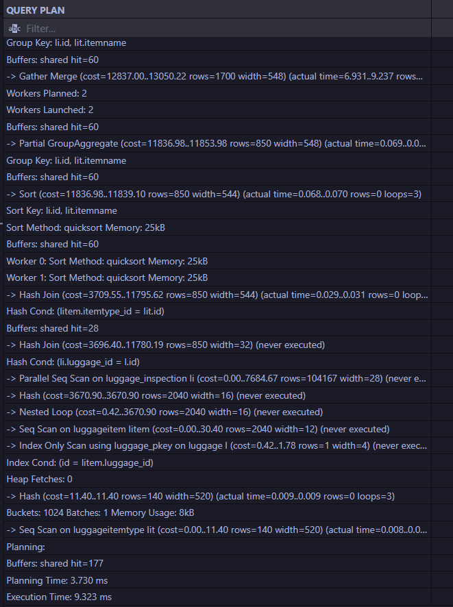
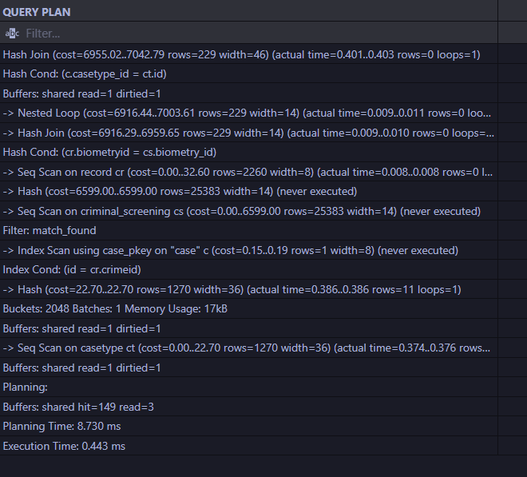
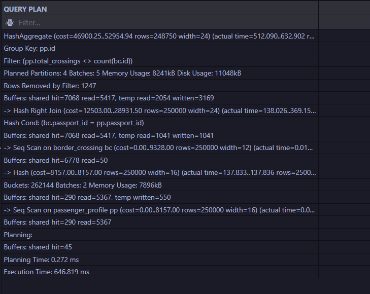
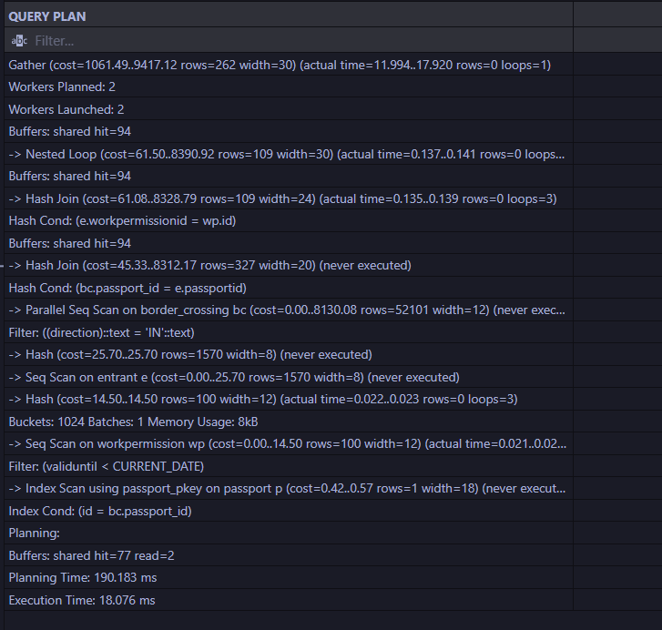

## Домашка 3
---
### Запросы на GIN и GiST

#### GIN

```sql
CREATE INDEX idx_border_crossing_metadata_gin 
ON analytics.border_crossing 
USING GIN (metadata);

CREATE INDEX idx_luggage_inspection_prohibited_gin 
ON analytics.luggage_inspection 
USING GIN (prohibited_items);
```

```sql
SELECT id, passport_id, crossing_time 
FROM analytics.border_crossing 
WHERE metadata @> '{"device": "scanner_0"}';

SELECT id, inspection_time, result 
FROM analytics.luggage_inspection 
WHERE prohibited_items && ARRAY['knife', 'battery'];

SELECT id, crossing_time, declaration_text 
FROM analytics.border_crossing 
WHERE metadata ? 'customs_declaration';
```

---

#### Gist

```sql
CREATE INDEX idx_criminal_screening_geo_gist 
ON analytics.criminal_screening 
USING GiST (geo_location);

CREATE INDEX idx_criminal_screening_window_gist 
ON analytics.criminal_screening 
USING GiST (screening_window);
```

```sql
SELECT id, screening_time, geo_location 
FROM analytics.criminal_screening 
ORDER BY geo_location <-> point(55.75, 37.61) 
LIMIT 5;

SELECT id, biometry_id, threat_level 
FROM analytics.criminal_screening 
WHERE screening_window && tsrange('2026-02-18 18:00', '2026-02-19 12:00');

SELECT id, passport_id, total_crossings 
FROM analytics.passenger_profile 
WHERE active_period @> DATE '2024-06-15';
```

---

### Просмотр запросов на JOIN

```sql
EXPLAIN (ANALYZE, BUFFERS)
SELECT 
    bc.crossing_time, 
    bc.checkpoint_code, 
    p.fullName, 
    c.name as country_name
FROM analytics.border_crossing bc
JOIN identity.passport p ON bc.passport_id = p.id
JOIN identity.country c ON p.country = c.id
WHERE bc.direction = 'IN';
```



```sql
EXPLAIN (ANALYZE, BUFFERS)
SELECT 
    li.inspection_time, 
    li.result, 
    lit.itemName, 
    COUNT(litem.id) as item_count
FROM analytics.luggage_inspection li
JOIN items.luggage l ON li.luggage_id = l.id
JOIN items.luggageitem litem ON l.id = litem.luggage_id
JOIN items.luggageitemtype lit ON litem.itemtype_id = lit.id
GROUP BY li.id, lit.itemName;
```




```sql
EXPLAIN (ANALYZE, BUFFERS)
SELECT 
    cs.screening_time, 
    cs.threat_level, 
    c.caseType_id, 
    ct.description as case_description
FROM analytics.criminal_screening cs
JOIN criminal.record cr ON cs.biometry_id = cr.biometryId
JOIN criminal.case c ON cr.crimeId = c.id
JOIN criminal.casetype ct ON c.caseType_id = ct.id
WHERE cs.match_found = true;
```



```sql
EXPLAIN (ANALYZE, BUFFERS)
SELECT 
    pp.passport_id, 
    pp.total_crossings as profile_count, 
    COUNT(bc.id) as actual_count
FROM analytics.passenger_profile pp
LEFT JOIN analytics.border_crossing bc ON pp.passport_id = bc.passport_id
GROUP BY pp.id, pp.total_crossings
HAVING pp.total_crossings != COUNT(bc.id);
```



```sql
EXPLAIN (ANALYZE, BUFFERS)
SELECT 
    bc.crossing_time, 
    p.fullName, 
    wp.activityId, 
    wp.validUntil as work_permission_validity
FROM analytics.border_crossing bc
JOIN identity.passport p ON bc.passport_id = p.id
JOIN people.entrant e ON p.id = e.passportId
JOIN papers.workpermission wp ON e.workPermissionId = wp.id
WHERE bc.direction = 'IN' 
  AND wp.validUntil < CURRENT_DATE;
```



### Локальное поднятие postgres exporter + prometheus + grafana

информация в docker-compose.yml и json-коде дашборда