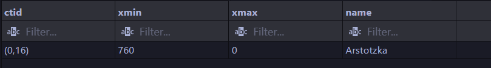
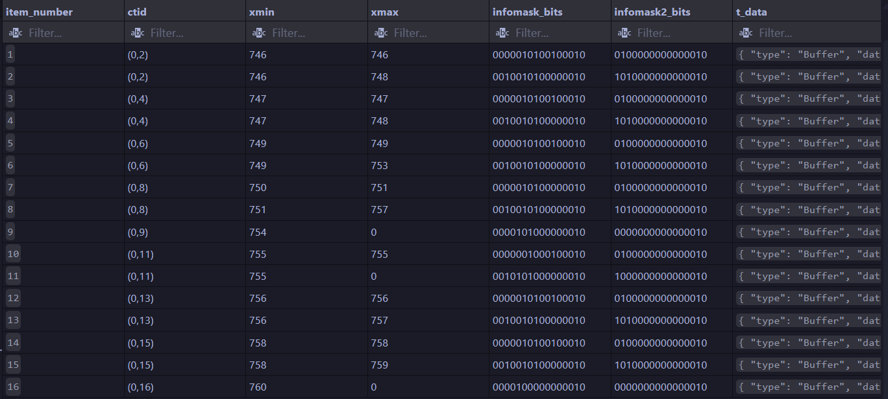
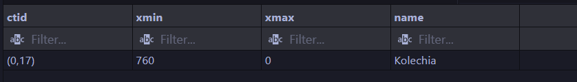
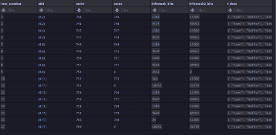
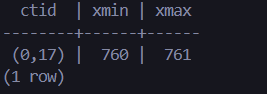
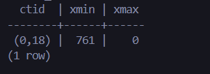
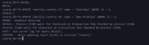
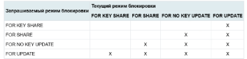

## Домашка 4 по базам данных (MVCC)


### 1. Моделирование обновления данных

```sql
INSERT INTO identity.country (id, name) VALUES (1, 'Arstotzka');

-- Запрос для просмотра масок и служебных полей
SELECT ctid, xmin, xmax, name FROM identity.country;
SELECT 
    lp as item_number,
    t_ctid as ctid,
    t_xmin as xmin,
    t_xmax as xmax,
    t_infomask::bit(16) as infomask_bits,
    t_infomask2::bit(16) as infomask2_bits,
    t_data -- здесь лежат сами данные в бинарном виде
FROM heap_page_items(get_raw_page('identity.country', 0));

UPDATE identity.country SET name = 'Kolechia' WHERE id = 1;

-- Запрос для просмотра масок и служебных полей
SELECT ctid, xmin, xmax, name FROM identity.country;
SELECT 
    lp as item_number,
    t_ctid as ctid,
    t_xmin as xmin,
    t_xmax as xmax,
    t_infomask as infomask_bits, 
    t_infomask2 as infomask2_bits, 
    t_data -- здесь лежат сами данные в бинарном виде
FROM heap_page_items(get_raw_page('identity.country', 0));
```

---




[SELECT 1] 

тут мы видим адрес строки в ctid = (0, 16), 
номер транзакции в xmin = 760,
xmax = 0;

также по этому адресу мы можем увидеть его infomask'и;

---




[SELECT 2] 

тут мы видим адрес строки в ctid = (0, 17), 
номер транзакции в xmin = 760 - тот же, что при INSERT,
xmax = 0;

Также (как и до этого) по этому адресу мы можем увидеть его infomask'и;
но еще мы можем увидеть запись с тем же ctid, xmin, у которого xmax = 760. 

Это - удаленная при Update запись втавленной нами (1, 'Arstotzka');

---

### 2. Что такое t_infomask?

#### Это битовая маска (16 бит), которая описывает текущее состояние версии строки (кортежа). Она нужна, чтобы PostgreSQL не лез каждый раз в таблицу статусов транзакций (CLOG) для проверки видимости.
#### Основные биты:
- 0x0001 (1-й бит): HASNULL (есть ли NULL в строке).
- 0x0002 (2-й бит): HASVARWIDTH (есть ли поля переменной длины, как твой VARCHAR).
- 0x0100 (9-й бит): XMIN_COMMITTED (транзакция-создатель подтверждена).
- 0x0200 (10-й бит): XMIN_INVALID (транзакция-создатель отменена).
- 0x0400 (11-й бит): XMAX_COMMITTED (транзакция-удалить подтверждена — строка "мертва").
- 0x0800 (12-й бит): XMAX_INVALID (транзакция-удалить отменена — строка "жива").

---

### 3. Как служебные столбцы ведут себя в разных транзакциях

```sql
--[терминал 1]
BEGIN;
UPDATE identity.country SET name = 'X' WHERE id = 1;

--[терминал 2]
SELECT ctid, xmin, xmax FROM identity.country;

--[терминал 1]
COMMIT;

--[терминал 2]
SELECT ctid, xmin, xmax FROM identity.country
```

*Транзакция до коммита*



Тут видно, что:
- xmin имеет идентификатор *предыдущей транзакции* - 760
- xmax имеет идентификатор *текущей транзакции* - 761


*Транзакция после коммита*



Тут видно изменения:
- номер ctid изменился - (0, 17)
- xmin имеет идентификатор *текущей транзакции* - 761 - знак того, что эти изменения закоммичены
- xmax имеет идентификатор 0

*по этим данным видно, что до коммита транзакция видела предыдущую версию строки (зафиксированная в начале COMMIT), а после - измененную*

---

### 4. Смоделировать дедлок

```sql
--[терминал 1]
BEGIN;

--[терминал 2]
BEGIN;

--[терминал 1]
UPDATE identity.country SET name = 'Arstozka' WHERE id = 5;

--[терминал 2]
UPDATE identity.country SET name = 'Kolechia' WHERE id = 6;

--[терминал 1]
UPDATE identity.country SET name = 'New Kolechia' WHERE id = 6;

--[терминал 2]
UPDATE identity.country SET name = 'New Artotzka' WHERE id = 5;
```

На такую последовательность команд я:
- получил выполнение запроса (второй запрос был пропущен):
```sql
UPDATE identity.country SET name = 'New Kolechia' WHERE id = 6;
```
- получил такой ответ (в терминале 2):
```
ERROR:  deadlock detected
DETAIL:  Process 11990 waits for ShareLock on transaction 768; blocked by process 12108.
Process 12108 waits for ShareLock on transaction 769; blocked by process 11990.
HINT:  See server log for query details.
CONTEXT:  while updating tuple (0,24) in relation "country"
```



---

### 5. Режимы блокировок



Таким образов выглядит таблица конфликтов для режимов блокировки для строк

Вот запросы для проверки конфликтов

```sql
--[terminal 1]
BEGIN;

SELECT *
FROM identity.passport
WHERE id = 5
FOR UPDATE;

--SELECT отработал

--[termonal 2]
BEGIN;

SELECT *
FROM identity.passport
WHERE id = 5
FOR UPDATE;

-- его заблочила первая транзакция (конфликт FOR UPDATE c UPDATE)

--[termonal 3]
BEGIN;

SELECT *
FROM identity.passport
WHERE id = 1
FOR SHARE;

-- его заблочила первая транзакция (конфликт FOR UPDATE c SHARE)

--[termonal 4]
BEGIN;


UPDATE identity.passport
SET fullName = 'Changed'
WHERE id = 5;

-- его заблочила первая транзакция (конфликт FOR UPDATE c UPDATE (требующий NO KEY UPDATE))

--[terminal 1]
COMMIT;

-- тут отработала транзакция из [terminal 2] (FOR UPDATE не мешает)

--[terminal 2]
COMMIT;

-- тут отработала транзакция из [terminal 3] (FOR UPDATE из [terminal 2] не мешает FOR SHARE)

--[terminal 3]
COMMIT;

-- тут отработала транзакция из [terminal 4] (FOR SHARE не мешает UPDATE)

--[terminal 4]
COMMIT;
```

---

### 6. Очистка таблицы

Создание мертвых записей:

```sql
INSERT INTO identity.passport(fullName, issueDate, validUntil, country, biometry)
SELECT
    'Test Person ' || g,
    '2020-01-01',
    '2030-01-01',
    7,
    1
FROM generate_series(1, 10000) g;

DELETE FROM identity.passport
WHERE id % 2 = 0;
```

проверка на мертвые записи в таблице:

```sql
SELECT
    relname,
    n_live_tup,
    n_dead_tup
FROM pg_stat_user_tables
WHERE relname = 'passport';

SELECT
    pg_size_pretty(pg_total_relation_size('identity.passport'));
```


---

Проводим операцию ваакум и снова проверяем:

```sql
VACUUM identity.passport;

SELECT
    relname,
    n_live_tup,
    n_dead_tup
FROM pg_stat_user_tables
WHERE relname = 'passport';

SELECT
    pg_size_pretty(pg_total_relation_size('identity.passport'));
```


Мертвые строки пропали, но размер остался тот же

---

Проводим VAACUM FULL

```sql
VACUUM FULL identity.passport;

SELECT
    pg_size_pretty(pg_total_relation_size('identity.passport'));
```


таблица перестроилась с нуля без мертвых записей и стала весить меньше
