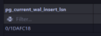
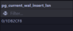
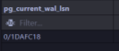
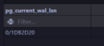
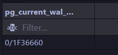
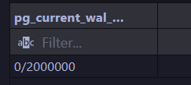
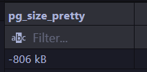
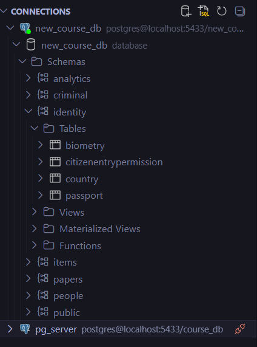

## Домашка 5 по базам данных (WAL & dump)
---
### 1. LSN и WAL после изменения данных

#### 1.1 - 1.2. (Сравнение LSN до и после INSERT, Сравнение WAL до и после commit)

```sql
BEGIN;
SELECT pg_current_wal_lsn();
SELECT pg_current_wal_insert_lsn();

INSERT INTO identity.passport 
(   
    fullname, 
    issuedate, 
    validuntil, 
    biometry, 
    country
    ) 
VALUES 
(
    'John Doe number 67', 
    CURRENT_DATE, 
    CURRENT_DATE + (random()*3000)::int, 
    1, 
    7
);

SELECT pg_current_wal_insert_lsn();

COMMIT;

SELECT pg_current_wal_lsn();
```

по скриншотам мы видим, что после INSERT и COMMIT значения изменились (увеличились)




---





#### 1.3. Анализ WAL размера после массовой операции

```sql
SELECT pg_current_wal_lsn();

INSERT INTO identity.passport(fullName, issueDate, validUntil, country, biometry)
SELECT
    'Bulk ' || g,
    '2020-01-01',
    '2030-01-01',
    7,
    1
FROM generate_series(1, 10000) g;

SELECT pg_current_wal_lsn();
```



на этих примерах мы видим, что различие значительное
---

```sql
SELECT pg_size_pretty(
    pg_wal_lsn_diff(
        '0/1F36660',
        '0/2000000'
    )
);
```




---

### 2. Дамп бд

```bash
# dump структуры таблиц
docker exec -t pg_course pg_dump -U postgres -d course_db --schema-only > schema_dump.sql

# dump таблицы identity.country
docker exec -t pg_course pg_dump -U postgres -d course_db \       
  -t identity.passport \
  > passport_full_dump.sql
```

```bash
docker exec -it pg_course psql -U postgres -c "CREATE DATABASE new_course_db;"
#накат структуры таблиц
docker exec -i pg_course psql -U postgres -d new_course_db < schema_dump.sql

#накат таблицы identity.country
docker exec -i pg_course psql -U postgres -d new_course_db < country_dump.sql
```


---

### 3. Создание нескольких *seed* и проверка идемпотентности


```sql
-- seed для стран
insert into identity.country (id, name) 
values 
    (1, 'Россия'),
    (2, 'США'),
    (3, 'КНДР'),
    (4, 'Китай'),
    (5, 'Казахстан'),
    (6, 'Германия'),
    (7, 'Афганистан'),
    (8, 'Мексика'),
    (9, 'Нигер')
ON CONFLICT (id) DO NOTHING;

-- seed для биометрии
INSERT INTO identity.biometry
SELECT FROM generate_series(1, 250000)
ON CONFLICT (id) DO NOTHING;

-- seed для пасспортов
INSERT INTO identity.passport (fullName, issueDate, validUntil, biometry, country)
SELECT 
    'Person ' || b.id,
    CURRENT_DATE - (random()*3000)::int,
    CURRENT_DATE + (random()*3000)::int,
    b.id,
    1
FROM identity.biometry b
ON CONFLICT (id) DO NOTHING;
```

при первом вызове seed произошло заполнение таблиц данными


а при повторном заполнении заполнились только таблицы (biomentry, passport), а country остался тем же из-за конфликта с id.