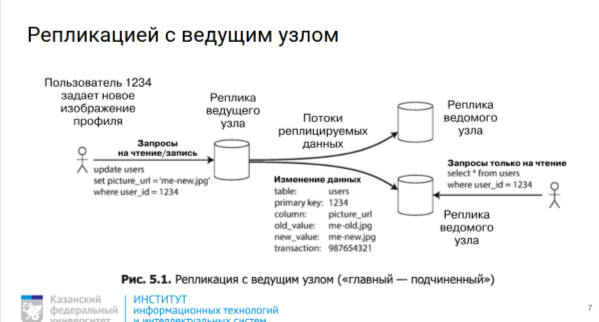
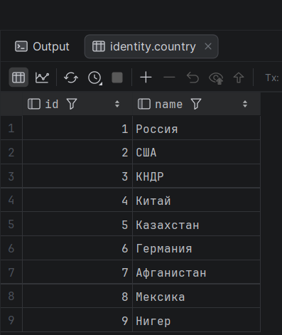
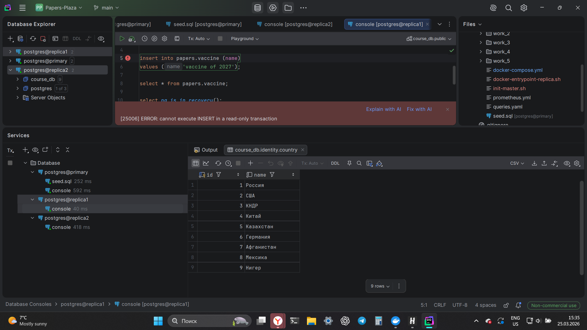
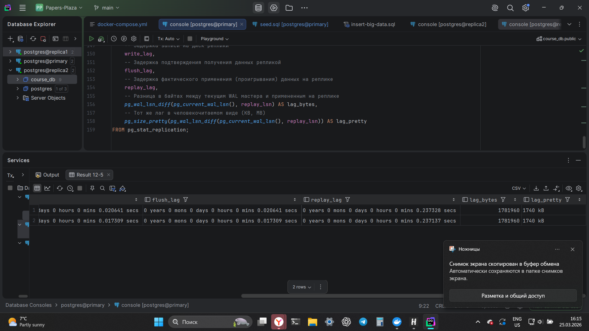
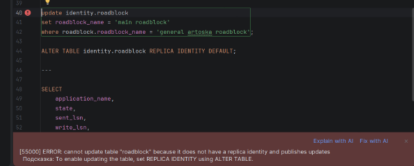
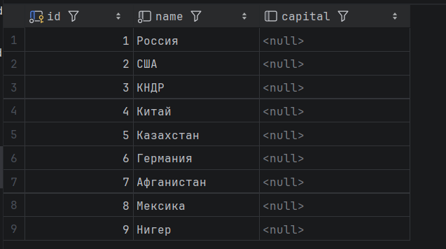

## Домашка 6 по базам данных (Replication)

---

### 1. Архитектура решения

Для выполнения задачи развернуты две независимые инфраструктуры:

Physical Replication: 1 Master (Primary) + 2 Replicas (Standby).

Logical Replication: 1 Publisher + 1 Subscriber.



---

### 2. Физическая потоковая репликация (Physical Streaming)

2.1. Развертывание 3-х инстансов
Использован docker-compose с автоматической очисткой данных на репликах и выполнением pg_basebackup.

**смотри файл docker-compose.yml**

```sh
---- docker-entrypoint-replica.sh

#!/bin/bash
set -e

# Ждем, пока мастер станет доступен
until pg_isready -h pg_primary -p 5432 -U postgres; do
  echo "Waiting for master..."
  sleep 2
done

# Если данных еще нет, делаем бекап
if [ ! -s "$PGDATA/PG_VERSION" ]; then
  echo "Clearing data directory and starting basebackup..."
  rm -rf "$PGDATA"/*
  PGPASSWORD=pass pg_basebackup -h pg_primary -D "$PGDATA" -U replicator -vP -R
fi

# Запускаем Postgres
exec docker-entrypoint.sh postgres

----- init-master.sh

#!/bin/bash
set -e

psql -v ON_ERROR_STOP=1 --username "$POSTGRES_USER" --dbname "$POSTGRES_DB" <<-EOSQL
    CREATE ROLE replicator WITH REPLICATION LOGIN PASSWORD 'pass';
EOSQL

# 2. Разрешаем подключения для репликации со всех IP внутри сети Docker
# Мы записываем это прямо в pg_hba.conf, который лежит в $PGDATA
echo "host replication replicator 0.0.0.0/0 md5" >> "$PGDATA/pg_hba.conf"
```

2.2. Проверка репликации данных

```
была проведена миграция с помощью flyway на primary базу данных, и эти данные реплицировались на 2 replica
```



```
при попытке вставки данных на реплике:
```




### 2.3. Анализ replication lag

я создал нагрузку с помощью следующего insert:

```sql
INSERT INTO analytics.border_crossing
(
    passport_id,
    crossing_time,
    checkpoint_code,
    direction,
    transport_type,
    risk_level,
    officer_id,
    declaration_text,
    metadata,
    luggage_weight_range
)
SELECT
    p.id,
    now() - (random()*1000 || ' hours')::interval,

    -- skewed distribution
    CASE
        WHEN random() < 0.7 THEN 'CHK_A'
        ELSE 'CHK_' || (random()*9)::int
    END,

    (ARRAY['IN','OUT'])[floor(random()*2+1)],

    (ARRAY['CAR','BUS','AIR','TRAIN'])[floor(random()*4+1)],

    (random()*4 + 1)::int,

    (random()*500)::int,

    CASE WHEN random() < 0.15 THEN NULL
         ELSE 'Declaration text ' || md5(random()::text)
    END,

    jsonb_build_object(
        'device', 'scanner_' || (random()*5)::int,
        'priority', random()
    ),

    numrange(
        (random()*10)::numeric,
        ((random()+1)*50)::numeric
    )
FROM identity.passport p;


INSERT INTO analytics.luggage_inspection
(
    luggage_id,
    officer_id,
    inspection_time,
    result,
    suspicious_score,
    item_count,
    prohibited_items,
    notes,
    inspection_duration,
    extra_data
)
SELECT
    l.id,
    (random()*500)::int,
    now() - random() * INTERVAL '1000 hours',
    (ARRAY['CLEAR','CONFISCATED','WARNING'])[floor(random()*3+1)],
    random()*100,
    (random()*10)::int,
    CASE WHEN random() < 0.2 THEN NULL
         ELSE ARRAY['knife','liquid','battery']
    END,
    CASE WHEN random() < 0.15 THEN NULL
         ELSE 'Inspection note ' || md5(random()::text)
    END,
    random() * INTERVAL '6 minutes',
    jsonb_build_object('scanner_version', 'v' || (random()*3)::int)
FROM items.luggage l;


INSERT INTO analytics.criminal_screening
(
    biometry_id,
    screening_time,
    match_found,
    threat_level,
    case_type_id,
    screening_score,
    geo_location,
    screening_window,
    additional_info
)
SELECT
    b.id,
    now() - random() * INTERVAL '2000 hours',
    random() < 0.1,
    CASE WHEN random() < 0.1 THEN (random()*5)::int END,
    NULL,
    random()*10,
    point(random()*100, random()*100),
    tsrange(
        (now() - interval '1 day')::timestamp,
        now()::timestamp
    ),
    jsonb_build_object('engine','v2')
FROM identity.biometry b;


INSERT INTO analytics.passenger_profile
(
    passport_id,
    frequent_traveler,
    total_crossings,
    preferred_direction,
    average_risk,
    profile_notes,
    tags,
    risk_distribution,
    active_period
)
SELECT
    p.id,
    random() < 0.2,
    (random()*200)::int,
    (ARRAY['IN','OUT'])[floor(random()*2+1)],
    random()*5,
    CASE WHEN random() < 0.15 THEN NULL
         ELSE 'Profile ' || md5(random()::text)
    END,
    ARRAY['vip','monitor'],
    jsonb_build_object('risk_trend','stable'),
    daterange(CURRENT_DATE - 100, CURRENT_DATE + 100)
FROM identity.passport p;
```

и с помощью следующего запроса увидел нагрузку и задержку записи в реплику в очереди записи WAL в KB:

```sql
SELECT
    application_name,
    client_addr,
    state,
    sync_state,
    -- Задержка записи на диск реплики
    write_lag,
    -- Задержка подтверждения получения данных репликой
    flush_lag,
    -- Задержка фактического применения (проигрывания) данных на реплике
    replay_lag,
    -- Разница в байтах между текущим WAL мастера и примененным на реплике
    pg_wal_lsn_diff(pg_current_wal_lsn(), replay_lsn) AS lag_bytes,
    -- Тот же лаг в человекочитаемом виде (KB, MB)
    pg_size_pretty(pg_wal_lsn_diff(pg_current_wal_lsn(), replay_lsn)) AS lag_pretty
FROM pg_stat_replication;
```



---

### 2. Настроить Logical replication

принцип работы PUBLICATION/SUBSCRIPTION - основан на том, у нас есть независимые базы данных, где одна подписывается на изменения данных в другой таблице

```yml
services:
  pg_publisher:
    image: postgres:15
    container_name: pg_publisher
    environment:
      POSTGRES_USER: postgres
      POSTGRES_PASSWORD: pass
      POSTGRES_DB: course_db
    ports:
      - "5441:5432"
    command: >
      postgres
      -c wal_level=logical
      -c max_replication_slots=10
      -c max_wal_senders=10
    healthcheck:
      test: ["CMD-SHELL", "pg_isready -U postgres"]
      interval: 10s
      timeout: 5s
      retries: 5

  pg_subscriber:
    image: postgres:15
    container_name: pg_subscriber
    environment:
      POSTGRES_USER: postgres
      POSTGRES_PASSWORD: pass
      POSTGRES_DB: course_db
    ports:
      - "5442:5432"
    # Для подписчика wal_level=logical не обязателен, но полезен для каскадной репликации
    command: >
      postgres
      -c max_logical_replication_workers=10
      -c max_sync_workers_per_subscription=2

  flyway:
    image: flyway/flyway:latest
    container_name: flyway
    depends_on:
      pg_publisher:
        condition: service_healthy
    command:
      - "migrate"
    volumes:
      - ./db/migrations:/flyway/sql
    environment:
      FLYWAY_URL: jdbc:postgresql://pg_publisher:5432/course_db
      FLYWAY_USER: postgres
      FLYWAY_PASSWORD: pass
      FLYWAY_SCHEMAS: public
      FLYWAY_BASELINE_ON_MIGRATE: "true"
      FLYWAY_CLEAN_DISABLED: "false"


networks:
  default:
    name: logic_repl_network
```

```sql
-- publisher
CREATE SCHEMA identity;

CREATE TABLE identity.country (
      id SERIAL PRIMARY KEY,
      name VARCHAR(20) NOT NULL
);

insert into identity.country (id, name)
values
    (1, 'Россия'),
    (2, 'США'),
    (3, 'КНДР'),
    (4, 'Китай'),
    (5, 'Казахстан'),
    (6, 'Германия'),
    (7, 'Афганистан'),
    (8, 'Мексика'),
    (9, 'Нигер')
ON CONFLICT (id) DO NOTHING;

CREATE PUBLICATION my_all_pub FOR ALL TABLES;
```


```sql
--subscriber
-- перенос схем из publisher был воспроизведен с помощью pg_dump ()

CREATE SUBSCRIPTION my_sub
    CONNECTION 'host=pg_publisher port=5432 user=postgres password=pass dbname=course_db'
    PUBLICATION my_all_pub;
```

```sql
-- раскрытие пунка про "Как могут пригодится pg_dump для логического вида репликации - для переноса схем из одного узла в другой" 

docker exec -t pg_publisher pg_dump -U postgres -d course_db --schema-only > sub_schema.sql

Get-Content sub_schema.sql | docker exec -i pg_subscriber psql -U postgres -d course_db
```

2.2 При работе с ними я увидел, что данные реплицируются, а DLL - нет


2.3. Проверка REPLICA IDENTITY

```sql
-- publisher
create table identity.roadblock (
    roadblock_name varchar(100) not null
);


insert into identity.roadblock (roadblock_name)
values ('general artoska roadblock'),
       ('secondary artotska roadblock');

update identity.roadblock
set roadblock_name = 'main roadblock'
where roadblock.roadblock_name = 'general artoska roadblock';
```

```sql
--subscriber

create table identity.roadblock (
    roadblock_name varchar(100) not null
);
```

по итоду из-за отсутствия идентификатора я словил ошибку:




### 2.4. Проверку отсутствия DDL (изменения в главной базе не реплицировались на ведомую)

```sql
-- publisher

alter table identity.country add column capital varchar(100);

select * from identity.country;
```



```sql
--subscriber

select * from identity.country;
```

