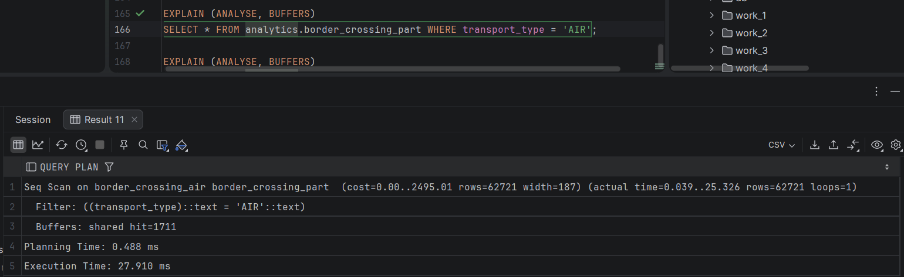
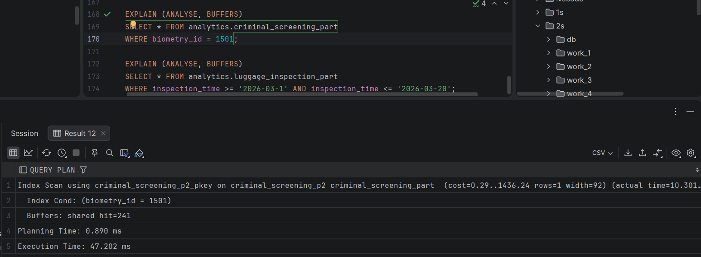
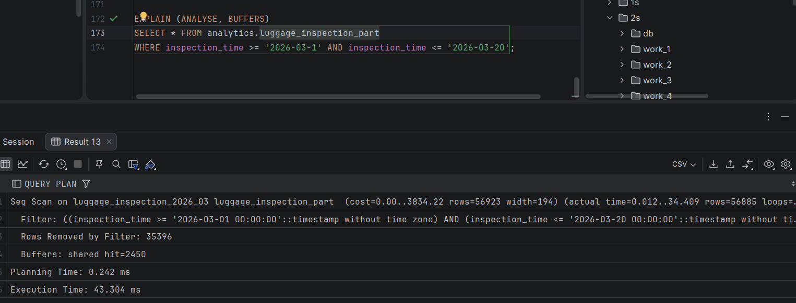
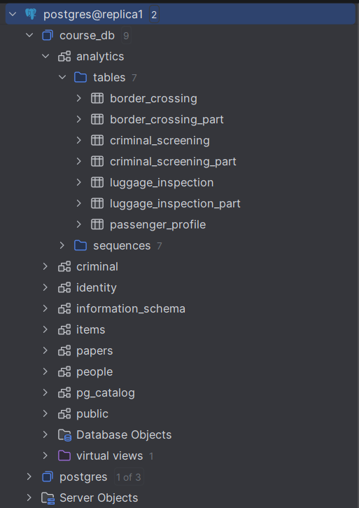
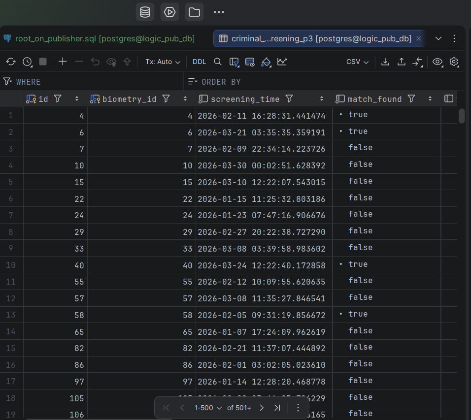
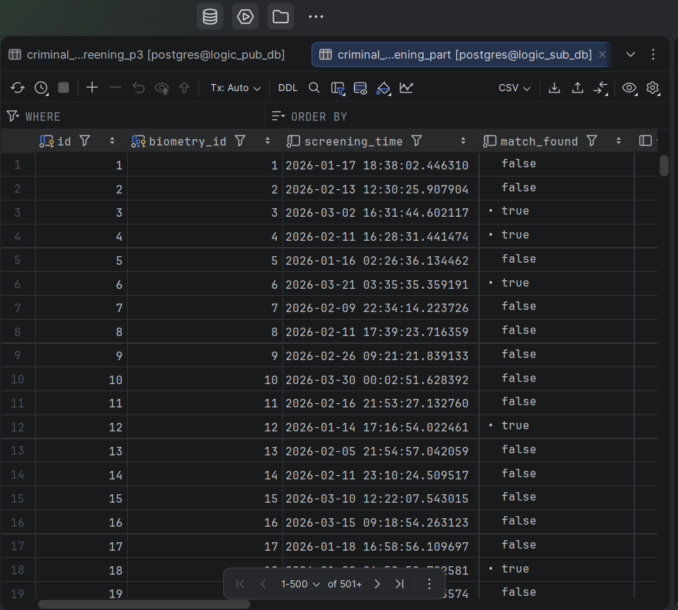
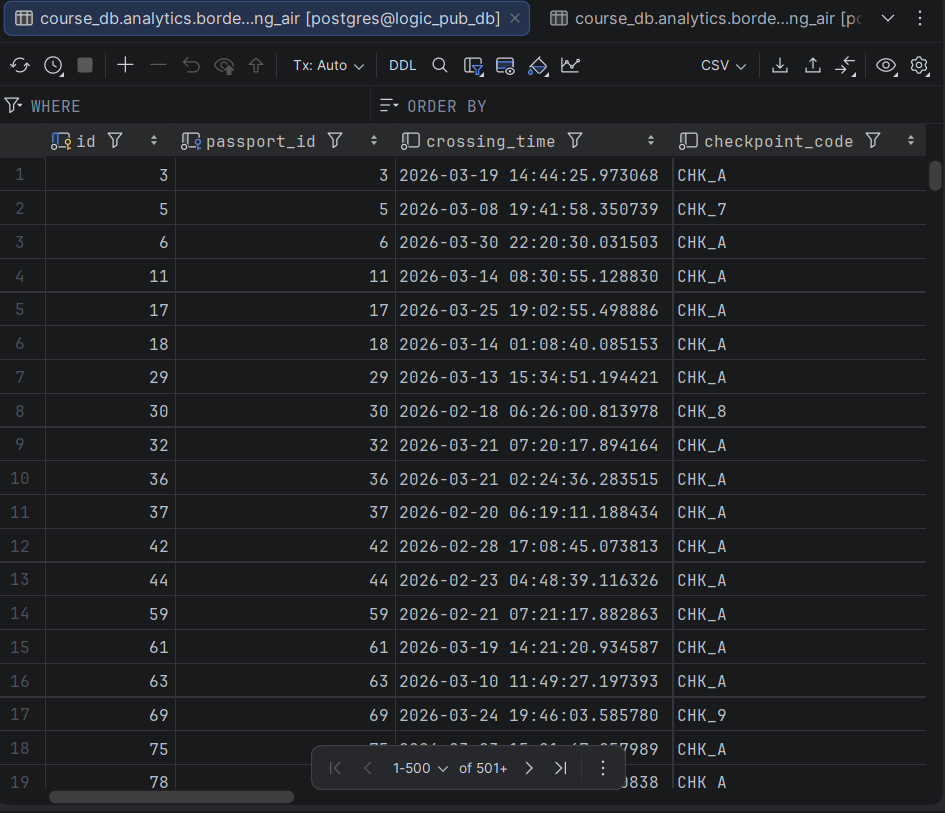
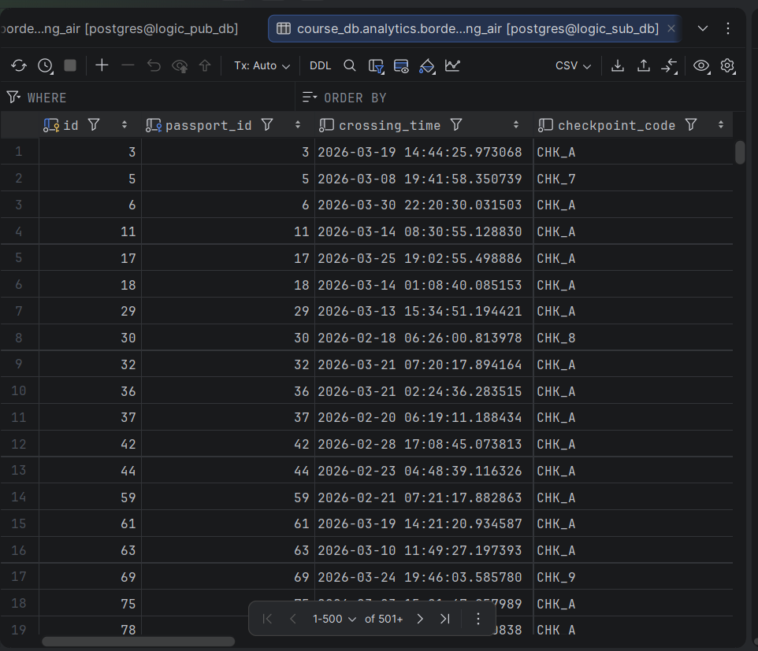
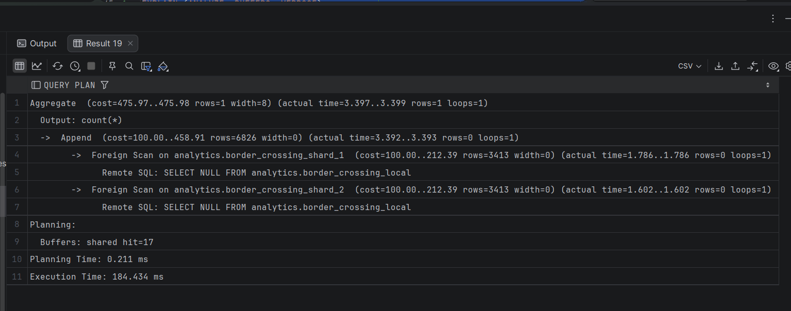
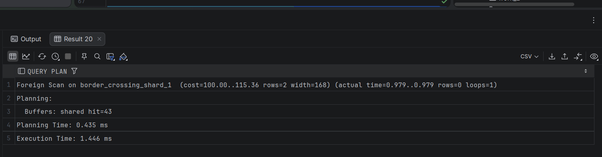

## Домашка № 7 (секционирование и шардирование)

### 1. Секционирование: RANGE / LIST / HASH.

#### Для секционирования здесь я выбрал таблицы, связанными с analytics, так как по логике в них происходит постоянное записывание новых записей



Простой запрос на LIST partition: используется 5 партиций
---


Простой запрос на HASH partition: используется 4 партиции и есть индекс
---


Простой запрос на RANGE partition : используется 5 партиций
---

Резюмируя:
- во всех используется Partition pruning

---
### 2. Секционирование и физическая репликация

#### 2.1. Есть ли секционирование на репликах?

#### Ответ: да, есть




#### 2.2. Почему репликация "не знает" про секции?

Ответ:
Физическая репликация работает на уровне блоков (pages), а не на уровне логических таблиц.
WAL-запись говорит не "Вставь строку в партицию за январь", а "Измени блок №5432 в файле отношения с OID 12345".
Механизм репликации "слеп" к логике секционирования. 
Он просто копирует байты.

---
### 3. Логическая репликация и секционирование

#### 3.1. publish_via_partition_root = on

#### При данном режиме я создал и заполнил партиционированную таблицу criminal_screening_part на издателе, 
#### и создал обычную таблицу (без партиций) на подписчике, который све записывает туда






#### 3.1. publish_via_partition_root = off

#### При данном режиме я создал и заполнил идентичные партиционированные таблицы border_crossing_part на обоих серверах






---
### 4. Шардирование через postgres_fdw

#### shard1
```sql
-- Подключаемся к shard_db_1
CREATE SCHEMA IF NOT EXISTS analytics;

CREATE TABLE analytics.border_crossing_local (
    id BIGSERIAL PRIMARY KEY,
    passport_id INT NOT NULL,
    crossing_time TIMESTAMP NOT NULL,
    checkpoint_code VARCHAR(10) NOT NULL,
    direction VARCHAR(10) NOT NULL,
    transport_type VARCHAR(20) NOT NULL,
    risk_level SMALLINT NOT NULL,
    officer_id INT NOT NULL,
    created_at TIMESTAMP DEFAULT now()
);

-- Ограничение CHECK, чтобы гарантировать целостность данных на шарде
ALTER TABLE analytics.border_crossing_local
    ADD CONSTRAINT chk_passport_range_1
        CHECK (passport_id >= 1 AND passport_id <= 125000);

-- Индексы для производительности
CREATE INDEX idx_bc_local_passport ON analytics.border_crossing_local (passport_id);
CREATE INDEX idx_bc_local_time ON analytics.border_crossing_local (crossing_time);
```

---

#### shard2
```sql
-- Подключаемся к shard_db_2
CREATE SCHEMA IF NOT EXISTS analytics;

CREATE TABLE analytics.border_crossing_local (
    id BIGSERIAL PRIMARY KEY,
    passport_id INT NOT NULL,
    crossing_time TIMESTAMP NOT NULL,
    checkpoint_code VARCHAR(10) NOT NULL,
    direction VARCHAR(10) NOT NULL,
    transport_type VARCHAR(20) NOT NULL,
    risk_level SMALLINT NOT NULL,
    officer_id INT NOT NULL,
    created_at TIMESTAMP DEFAULT now()
);

-- Другой диапазон для второго шарда
ALTER TABLE analytics.border_crossing_local
    ADD CONSTRAINT chk_passport_range_2
        CHECK (passport_id > 125000 AND passport_id <= 250000);

CREATE INDEX idx_bc_local_passport ON analytics.border_crossing_local (passport_id);
CREATE INDEX idx_bc_local_time ON analytics.border_crossing_local (crossing_time);
```

---

#### router_db
```sql
-- Подключаемся к router_db (Порт 5422)
CREATE EXTENSION IF NOT EXISTS postgres_fdw;

-- Создаем объекты для подключения к Шарду 1
CREATE SERVER shard_server_1
    FOREIGN DATA WRAPPER postgres_fdw
    OPTIONS (host 'shard_server_1', port '5432', dbname 'shard_db_1');

-- Создаем объекты для подключения к Шарду 2
CREATE SERVER shard_server_2
    FOREIGN DATA WRAPPER postgres_fdw
    OPTIONS (host 'shard_server_2', port '5432', dbname 'shard_db_2');

-- Создаем маппинг пользователей (чтобы роутер мог ходить на шарды)
CREATE USER MAPPING FOR postgres
    SERVER shard_server_1
    OPTIONS (user 'postgres', password 'postgres');

CREATE USER MAPPING FOR postgres
    SERVER shard_server_2
    OPTIONS (user 'postgres', password 'postgres');


CREATE SCHEMA IF NOT EXISTS analytics;

-- Foreign таблица для Шарда 1
CREATE FOREIGN TABLE analytics.border_crossing_shard_1 (
    id BIGINT,
    passport_id INT,
    crossing_time TIMESTAMP,
    checkpoint_code VARCHAR(10),
    direction VARCHAR(10),
    transport_type VARCHAR(20),
    risk_level SMALLINT,
    officer_id INT,
    created_at TIMESTAMP
    )
    SERVER shard_server_1
    OPTIONS (schema_name 'analytics', table_name 'border_crossing_local');

-- Foreign таблица для Шарда 2
CREATE FOREIGN TABLE analytics.border_crossing_shard_2 (
    id BIGINT,
    passport_id INT,
    crossing_time TIMESTAMP,
    checkpoint_code VARCHAR(10),
    direction VARCHAR(10),
    transport_type VARCHAR(20),
    risk_level SMALLINT,
    officer_id INT,
    created_at TIMESTAMP
    )
    SERVER shard_server_2
    OPTIONS (schema_name 'analytics', table_name 'border_crossing_local');


-- создаем view как общую точку доступа к шардам
CREATE VIEW analytics.border_crossing AS
SELECT * FROM analytics.border_crossing_shard_1
UNION ALL
SELECT * FROM analytics.border_crossing_shard_2;
```

#### Общий запрос
```sql
EXPLAIN (ANALYZE, BUFFERS, VERBOSE)
SELECT count(*) FROM analytics.border_crossing;
```

Тут мы видим обращение к шардам через Append (обращение к серверу) и Foreign Key



---

#### Запрос к конкретному шарду
```sql
EXPLAIN (ANALYZE, BUFFERS)
SELECT * FROM analytics.border_crossing_shard_1
WHERE passport_id = 500;
```

Тут происходит прямое обращение к таблице (конкретному шарду)

